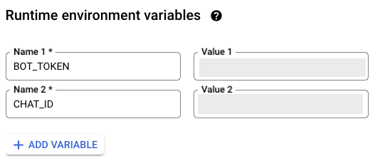

# 目錄
<a name="table-of-contents"></a>

- [PubSub Subscription 傳送的訊息格式](#sub-msg-format)
- [1st gen cloud function 範例碼](#cloud-func-sample)


# PubSub Subscription 傳送的訊息格式   <sub>[[返回目錄]](#table-of-contents)</sub>
<a name="sub-msg-format"></a>

經過 PubSub subscription 透過 http 傳遞訊息到 第一代 (1st gen), 原始訊息會被包到 `data` 屬性中，
cloud function 必須將 `message.data` 欄位內容取出後以 base64 decode 解析，
取得原始傳入 PubSub topic 的訊息字串，
以下為 [pubsub 所傳送訊息格式](https://cloud.google.com/pubsub/docs/reference/rest/v1/PubsubMessage) 範例


```json
{
  "message": {
    "data": "eW91ciBsb2cgZW50cnk=",
    "messageId": "7430248718308519",
    "publishTime": "2023-04-07T08:23:43.74Z",
  },
  "subscription": "projects/{subscription-project}/subscriptions/{subscription-name}"
}

```

其中各欄位

data：以 Base64 編碼的日誌資料。可以使用解碼該資料並讀取其中的內容。

messageId：消息的唯一 ID。

publishTime：消息發佈的 RFC3339 時間戳記。


# 1st gen cloud function 範例碼 <sub>[[返回目錄]](#table-of-contents)</sub>

<a name="cloud-func-sample"></a>


- 請參考 github repository 中 telegram 資料夾下的程式碼與設定檔。

  針對 telegram 下各類語言皆是 以 GET method 呼叫 telegram [sendMessage API](https://core.telegram.org/bots/api#sendmessage)，或是透過套件呼叫 API。你可以自由修改選擇哪一種方法傳送訊息。

  使用 github telegram 中所有範例程式中都需在 GCP cloud function 中設置 2 個環境變數:

  1. `BOT_TOKEN`: 申請 telegram bot 時，給予的 API_TOKEN
  2. `CHAT_ID`: telegram bot 傳送訊息的聊天室 ID，可以將 bot 添加到群組聊天室或是個人聊天室，添加後取得該聊天室的 ID。
  

  


- 你也可以參考 Google Cloud Function 相關文件: 
https://cloud.google.com/functions/docs/writing/write-http-functions?hl=zh-cn#http-example-nodejs

